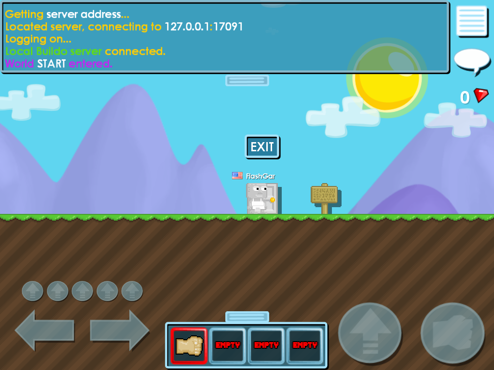
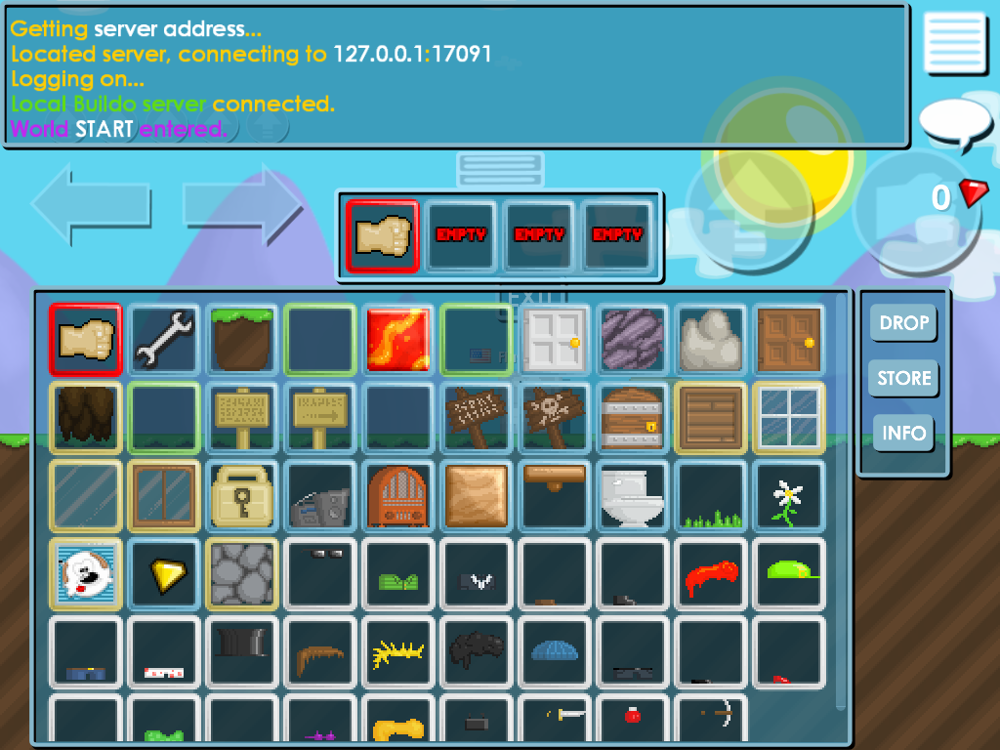

# Buildo — a local server for the November 2012 Growtopia prototype

Seth Robinson released the first playable Growtopia build in November 2012 and
then the servers went away, which left a client that boots, phones a dead host
and waits forever. This repository is a server that build will talk to, plus
the reverse-engineering notes that made it possible.

**It is playable.** You can walk, dig, build, wear clothes, plant a tree, put a
lock down, go through a door into another world and pick gems out of the dirt —
on the original 2012 binary, unmodified except for two patched string
constants.

It runs on macOS under Wine. No root, no internet, and your copy of the game is
never written to.

A generated world with every special tile turned on
(`BUILDO_FEAT=dslpbrw BUILDO_SEED_STAGE=6`). The wood platform and the tree
fruit are both restorations argued from unclaimed art — see
[PROGRESS.md phase 10](docs/PROGRESS.md#phase-10--the-items-the-art-proves-and-the-data-lacks).

| | |
|---|---|
|  |  |
| A fresh world, first connect. `Local Buildo server connected.` | All 52 items, right sprites, border colour per material |

---

## What this is, and what it is not

It is **preservation, not a private server project**. The distinction shows up
on every page: behaviour is included when the binary proves it exists, and
labelled as ours when it does not. Two features we had already built were
*deleted* on discovering nothing pinned them.

Seth published this build himself, so the client is his to give away — but it
is not ours to redistribute. **This repository contains no game files.** See
[docs/SETUP.md](docs/SETUP.md) for what to get and the SHA-256 to check it
against.

---

## Start here

| if you want to… | read |
|---|---|
| run it | [docs/SETUP.md](docs/SETUP.md) |
| know what has been done and how | [docs/PROGRESS.md](docs/PROGRESS.md) |
| know what the client can and cannot do, exhaustively | [docs/WHAT-EXISTS.md](docs/WHAT-EXISTS.md) |
| implement something | [docs/PROTOCOL.md](docs/PROTOCOL.md) |
| verify a claim yourself | [docs/METHOD.md](docs/METHOD.md) |
| see the game / drive the client / dump its memory | [docs/TOOLS.md](docs/TOOLS.md) |
| pick up open work | [docs/OPEN-QUESTIONS.md](docs/OPEN-QUESTIONS.md) |
| contribute a finding | [CONTRIBUTING.md](CONTRIBUTING.md) |

    ~/buildo-server/play.sh            # or: play.sh SOMEWORLD

---

## Status

Verified by screenshot and by reading the client's own parsed memory — not by
"the server sent it, so it must have worked".

**Working**

- worlds load and render: smart-edge dirt with grass on top, corners and cave
  edges
- the avatar walks, jumps, falls and lands where it should
- punching cracks a tile, breaks it after its HP in hits, and drops it into
  the world as a pickup box
- placing consumes stock, respects background / seed / solid rules, shows the
  build grid
- the full 52-item inventory panel, with the right border colour per material
- clothing on all six body parts
- doors (all three kinds) carry you to another world; signs and locks work,
  with the lock's area outline drawn
- the wrench opens a dialog on a door, a lock or a sign and edits its label
- seeds grow through six stages into a fruiting tree you can harvest
- gems land on the counter in the corner
- lava kills you
- `/dance` and `/wave`

**Not working**

- world persistence to disk — worlds live in the `gs` process and die with it
- the SHOP / STORE buttons
- multiplayer beyond one client (untested, not known-broken)

Full detail: [docs/PROGRESS.md](docs/PROGRESS.md#current-status).

---

## How it works, in one paragraph

`patch_client.py` rewrites two constants in a *copy* of the exe so it resolves
`127.0.0.1` instead of `rtsoft.com`. `raw_httpd.py` answers the
`server_data.php` handshake (the client speaks HTTP/1.0 with bare `\n`, which
Python's `http.server` rejects — that one detail hid the endpoint for a day).
`gs` is the game server: ENet/UDP on 17091 with **the range coder and crc32
both enabled**, or every packet is silently dropped. `make_items.py` compiles
the shipped `item_definitions.txt` into the binary `items.dat` format the
client hashes and demands. `tools/cap.dll` is injected into the client and
hooks `SwapBuffers`, which is the only way to see the OpenGL framebuffer or
read the client's own parsed structures back out.

---

## Repository map

    play.sh              start everything and walk into a world
    start.sh             start the servers, drive the UI yourself
    dbg.sh               same as play.sh under WINEDEBUG
    shot.sh              grab the OpenGL framebuffer as a PNG

    server.cpp           the game server (C++ / enet)  ->  gs
    make_items.py        item_definitions.txt -> items.dat
    patch_client.py      rebuild Buildo-local.exe from a pristine Buildo.exe
    raw_httpd.py         server_data.php responder, tolerant of bare-\n HTTP
    ra.py                static analysis of Buildo.exe (capstone + pefile)
    rttex2png.py         decode the game's texture format
    udp_probe.py         raw UDP dump on 17091 — how the range coder was found
    drive.py             harness: kill / launch / click / read logs

    tools/cap.c          SwapBuffers hook: screenshots + memory dumps
    tools/inj.c          DLL injector (CreateRemoteThread + LoadLibraryA)
    tools/ui.c           click / drag / key / type from inside Wine
    tools/probe.sh       items | inv | world | bar | av memory dumps
    tools/itemsdat.py    read/rewrite a compiled items.dat field by field
    tools/run.sh         launch into a world without regenerating items.dat
    tools/trial.sh       one world-format experiment, reports if it parsed

    docs/                everything that was learned

    httpd.py             the FIRST server_data responder — Python's
                         http.server, which rejects the client's bare-\n
                         HTTP/1.0 and hides the endpoint. Kept because the
                         trap is worth seeing.
    shot.c               GDI window capture: returns black on OpenGL.
                         Superseded by tools/cap.c
    poke.c               the older input injector, superseded by tools/ui.c

Nothing is checked in that you cannot rebuild; the build commands are in
[docs/SETUP.md](docs/SETUP.md#4-build).

---

## Credits and licence

The game is Seth Robinson's, released publicly by him in 2012. The server,
tools and documentation in this repository are MIT-licensed — see
[LICENSE](LICENSE). Findings are meant to be taken and reused; if you build on
them, a link back helps the next person find the evidence.
