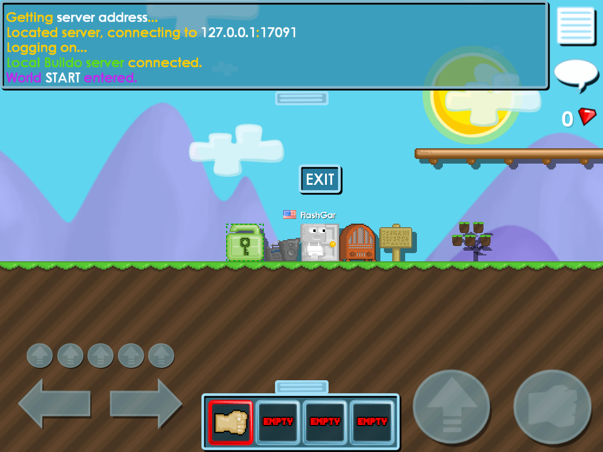

# Progress log

What was done, in the order it happened, and — more usefully — **how each
thing was found**. Every line here is either verified on a running client or
marked as an inference.

Worked on 2026-08-20 → 2026-08-22.

---

## Where this started

The Nov 2012 release is a client and nothing else. Launch it and it resolves
`rtsoft.com`, POSTs to `growtopia/server_data.php`, gets nothing, and sits at
a spinner forever. There is no server, no protocol document, no `.pdb` and no
dev notes. The exe names `d:\projects\proton\Buildo\bin\Buildo.pdb` and two
source paths leak out of one logging macro —
`..\source\Component\GameLogicComponent.cpp` and `..\source\Server\World.cpp` —
and that is the entire paper trail.

So the whole project is one question asked over and over: *what does the client
expect to be told, and how do I prove it rather than guess it?*

---

## Phase 1 — getting a connection at all

**Point the client at localhost.** `App::GetServerInfo` (VA 0x402450)
hardcodes the domain *and* the port in one seven-instruction function. Patched
in place — `"rtsoft.com"` → `"127.0.0.1"`, the `push 0x0A` length → `0x09`, the
`mov dword [eax], 0x50` → 8081. `patch_client.py` asserts the original bytes
first and writes a *copy*, `Buildo-local.exe`; the shipped exe is never
touched. A secondary `hamumu.com` endpoint sits beside the
`growtopia/server_data.php` string and looks like the real host — it is a
decoy, and chasing it wasted an afternoon.

**`server_data.php` looked dead and was not.** The client speaks HTTP/1.0 with
**bare `\n`** line endings. Python's `http.server` rejects that outright and
answers with its own 400 page, so the endpoint appeared to be ignored.
`raw_httpd.py` is a socket server tolerant of bare newlines. The reply must end
with `RTENDMARKERBS1001` — the client substring-searches for that marker before
firing OnFinish (0x494630).

**The game server needs two ENet options or it is invisible.** Every packet was
being dropped silently and the client only ever said "Connection timed out".
A raw UDP dump (`udp_probe.py`, with `gs` stopped) showed a 48-byte Connect
command arriving as ~31 bytes with header `0xCFFF` and four bytes of checksum
in front. That is enet's range coder *and* enet's crc32:

    enet_host_compress_with_range_coder(host);
    host->checksum = enet_crc32;

With those two lines the handshake completed on the first try.

---

## Phase 2 — being able to see anything

This unblocked everything after it, and it is the part most worth stealing.

The game renders through OpenGL, so GDI `BitBlt` returns a black rectangle
(`shot.exe` was written first and is useless), and macOS `screencapture`
refuses without Screen Recording permission that a terminal does not have. The
pixels are only readable **inside the process, with the GL context current**.

`tools/cap.dll` is injected by `tools/inj.exe` (CreateRemoteThread +
LoadLibraryA) and rewrites the exe's import-address-table entry for
`GDI32!SwapBuffers`. Every frame it checks for a request file and answers it:
`shot.sh` gives a PNG via `glReadPixels`, and `tools/probe.sh` dumps the
client's **own parsed state** out of its memory — the ItemInfo array, the
inventory, every non-empty tile, the item bar, the avatar.

Input had the same problem in reverse: macOS Accessibility is not granted to
the terminal, so synthetic input has to originate on the Windows side.
`tools/ui.exe` does `click`, `drag`, `key`, `type` from inside Wine. `drag` is
what opens the inventory panel.

`probe.sh av` is the single most valuable one: it prints the local NetAvatar
plus the whole tile column underneath it **including the empty tiles**, which
the world dump skips — and which is exactly where both collision bugs lived.

Objects are located by scanning committed memory for their RTTI vtable address
and validating the hit. The scan is bounded to the low 1 GB and to regions of
64 MB or less: an unvalidated hit on the stack once sent the dumper off a wild
pointer and wedged the render thread.

---

## Phase 3 — items.dat

The client will not enter a world until its item database matches. The
handshake turned out to be one comparison: the server's
`OnInitialLogonAccepted` carries a **uint32 hash of `cache/items.dat`** as its
first argument, the client hashes its own copy at 0x453410 and compares at
0x414596. Mismatch → `action|refresh_item_data` → the server answers with
packetType 16 and the client writes the file itself.

The record layout came out of the **symmetric (de)serializer at 0x43ACC0**,
where a single `bl` register selects read versus write, so one function
describes both directions: 30 fields, 57 fixed bytes, three strings.

Two traps, hours each:

* the final field's read and write branches **each** carry their own
  `add $N,(%esi)` before returning, so a naive scan counts it twice and you
  build 61-byte records;
* the client indexes the array **by item id**, not sequentially
  (`imul ebp, ebp, 0xac` at 0x443916) — the array has to be dense, entry *N*
  describing item *N*.

`make_items.py` compiles the shipped `game/item_definitions.txt` into that
format. `tools/itemsdat.py` reads and rewrites a compiled file field by field,
which is how every enum below was bisected: change one byte, relaunch, look.

---

## Phase 4 — the world blob, and the bug that corrupted it for a week

`World::Deserialize` (0x43F450) → `TileMap` (0x441B60) → `Tile` (0x43E850),
in-memory stride 0x38. Documented byte for byte in
[PROTOCOL.md](PROTOCOL.md#world).

**The trap:** `Tile::Serialize` reads fg/bg/word/flags and then calls
`SetItem` with the fg it just read. `SetItem` runs the material switch at
0x43e7ac and, for materials 2/3/4/7/13, allocates a TileExtra **and ORs flags
bit 0 into the tile** — *before* Serialize tests that bit at 0x43e92c. So a
tile whose foreground wants an extra must be followed by one no matter what
flags you wrote, or the read cursor desynchronises and every tile after it is
garbage. That is why worlds containing a door were unparseable for days while
worlds without one loaded fine.

TileExtra type 1 also has two shapes in the binary (one string or three) and
the world blob takes the **one-string** shape. Measured, not deduced: with one
string the blob the server sends and the size the client reports decompressing
are identical and every tile after the door survives. `BUILDO_DOOR_EXTRA=3`
switches back for re-testing.

---

## Phase 5 — making the avatar stand on the ground

Three separate bugs, all in one byte of the item record, and each one produced
a completely different wrong behaviour. This is the clearest example of why
"read the enum out of the renderer" beats "assume it matches modern Growtopia".

| symptom | cause | fix |
|---|---|---|
| dirt renders as one flat frame, no grass | `SMART_EDGE` written as 1 | the renderer at 0x444522 is `frame = (storage==1) ? fy*cols+fx : tile[+0x0a]`, and only storage 2/3 fill tile+0x0a → **SINGLE_FRAME = 1, SMART_EDGE = 2** |
| avatar cannot move at all, every tile solid | collision written into disk slot 11 | slot 11 is unknown; collision is **slot 12** (mem +0x5c). Slot 11 put item HP where collision belongs, and no item has HP 2 |
| avatar floats, rises exactly one tile per jump, never falls | `NONE` written as 2 | `eCollisionType` has **three** values: 0 none, 1 solid, **2 one-way platform**. `SetItem` writes `tile+0x0e = (collision != 0)`, so 2 gave all 6000 empty tiles a 1-pixel platform at their top edge |

That last one is the instructive one. `NetAvatar::IsTileBlocking` (0x4497b0) is
literally `blocked = (tile->[0x10] != 2)`, so if that function is all you read,
2 *looks* like NONE. It is not — the gate is tile+0x0e, and the collision query
at 0x44207f skips a tile whose +0x0e is 0 outright. `probe.sh av` printed the
before and after:

    before  ( 50, 28) fg=0 bg=0 blocked=1 coll=2     <- 1-px platform in the sky
    after   ( 50, 28) fg=0 bg=0 blocked=0 coll=0     <- not considered
    after   ( 50, 30) fg=2 bg=14 blocked=1 coll=1    <- the dirt it lands on

---

## Phase 6 — punching, building, and the wrench that was never dead

Every action the client takes on a tile — punch, place, wrench, wear — leaves
through the **same** function, 0x430f00: a 56-byte packet, `packetType = 3`,
intX/intY from the tile and `intData` = the held item. **The server decides
which of the four it was.** There is no separate "place" or "punch" message.

Which made the next bug invisible for a long time. `eTileMaterial 1` is not an
inert filler — **it is the wrench**. The world-click handler 0x436c80 does
`cmp [ebp+4],1 / sete bl` and, on an empty tile, refuses with
`audio/cant_place_tile.wav` *without sending the server anything*; on an
occupied tile it calls 0x43e450 (`(material - 2) <= 2`, true only for DOOR 2 /
LOCK 3 / SIGN 4) and acts only then. `make_items.py` had been handing material
1 to Dirt, Lava, Bedrock, Rock and Wood as filler — which is precisely why none
of those blocks could be placed, and why the wrench looked broken. It was
working the whole time; the server was answering it as a failed placement.

**8, 9 and 11 are the genuinely inert values**, the only ones compared against
nowhere in the binary. Which of the three the original build used for each
plain block is not recoverable.

Two more materials earned their meaning the same way. **5** plays the item's
third string as a sound on a punch; **6** animates the tile. Both do a bare
`div [esi+0xa8]` at 0x444573 on the frame after a punch, so a zero period is
`EXCEPTION_INT_DIVIDE_BY_ZERO` — punching a Boombox or the Olde Timey Radio
killed the client outright. `make_items.py` now supplies the period and the
sound path, and the pairing is not a guess: the build ships exactly
`audio/mp3/{boombox,old_timey}.mp3` and there are exactly two material-6 items.
Confirmed with `lsof` — with the radio on, the client holds the mp3 open.

**10 is lava**: 0x4474e0 negates the avatar's velocity and plays
`audio/burn.wav`.

---

## Phase 7 — clothing

Six slots at `PlayerItems + 6 + bodyPart*2` (0x43dcd0), and the read path
clears exactly 12 bytes there (0x43dbdf), so six is the count. The body part is
**nothing but the sprite slot index**, and an item's own texture filename is
ignored entirely for clothing.

The order was **measured off the screen, not deduced** — and the deduction was
wrong. The texture loader (0x44bd49..0x44c091) walks the sheets in a different
order, interleaving `player_arm`, `player_puncharm` and `player_face`; trusting
it put SHOES where FACEITEM belongs and made a top hat render as red hair. The
real mapping came from wearing six hair items with frames 1..6, one per slot,
and reading off which body part drew which frame:

    slot 0  hair       slot 3  feet
    slot 1  shirt      slot 4  faceitem
    slot 2  pants      slot 5  handitem

Frame index is `frameX + frameY*8` (0x44a055); every sheet is 256px wide in
32px cells.

There is **no wear button** — the panel has only DROP, STORE and INFO. You wear
a garment by holding it and clicking a tile, or (found later) by clicking its
inventory cell twice: 0x43615a sends packetType 10 only when the clicked cell
is already selected *and* the material is 14.

`OnSetClothing` must not go out in the same burst as `OnSpawn`; the netObject
does not exist yet and the client says so on its console. Same trap later bit
`OnAction`.

---

## Phase 8 — doors, locks, signs, dialogs, emotes

**Doors were fully present.** The receive-side jump table at 0x434418 sends
packetType 7 to the *default* case, so it looked unimplemented — but that table
is what the client can **receive**. What it *sends* is a separate question, and
only the wire answers it. There are exactly four outgoing packet builders (find
them by `push 0x38` + `call 0x4a1b30`): 0x430c90 sends **type 7 on a door
click**, 0x430cf0 type 10, 0x430f00 type 3, 0x431c35 type 11. A door's single
TileExtra string is its destination; `EXIT` or empty means out to the world
list. Verified end to end — clicking a door labelled SECOND printed
"World SECOND entered."

**All three doors work.** 6 Door (material 2), 12 User Door and 30 Dungeon
Door (both material 7). Materials 2 and 7 both get a type-1 TileExtra, which is
what the door-entry test wants (0x43e280). Only the white Door can be wrenched
— 0x43e450 allows materials 2/3/4 only — and you cannot wrench the door you are
standing in, because that gesture enters it. So player-linkable doors really
were a later-Growtopia feature; here the server sets destinations.

**The lock has no radius, and never did.** packetType 15 → 0x441070 places the
lock, sets the extra's owner from the packet's netID, then walks **netID2**
uint16s out of the extended data as **tile indices**, writing the lock's index
into tile+0x34 and setting flag 0x02 — which is exactly the conditional uint16
the world blob carries. The area is an explicit list the server chooses. There
was nothing to find because there is no radius in the binary. The client
*draws* the lock area and enforces nothing, so refusing edits is the server's
job — which is what `audio/punch_locked.wav` was always for.

**Dialogs work**, and their grammar was pinned rather than guessed: the parser
at 0x417e40 logs `Error with <cmd> parms` when a line is short, so feeding it
deliberately short lines names each argument count —
`add_label_with_icon|size|text|align|itemID`, `add_textbox|text|align`,
`end_dialog|name|cancel|ok`. Used for the INFO button and the wrench. One
gotcha: a dialog *name* must not contain a pipe, or `end_dialog`'s parser turns
the rest into button labels.

**Exactly two emotes exist** — `/dance` and `/wave` — and the client does not
parse them. The server sends `OnAction` (0x4471f0) and the client logs
`Unknown action: %s` for anything else. Any other command would be pure
invention.

---

## Phase 9 — drops, gems and growing things

**Objects.** World section 3 is `count`, `nextId`, then 16-byte records:
`uint16 itemId, float x, float y, uint8 count, uint8 flags, uint32 id`.
packetType 14 with netID −1 spawns one; any other netID removes it and gives it
to that player.

Three things had to be right, and each was wrong first:

* **The count travels in `floatVar`, not `objType`.** `AddObject` (0x43feb0)
  stores arg3 into obj+0x0e. Get it wrong and every drop has count 0 — the
  pickup box draws perfectly, vanishes when collected, and gives you nothing.
* **The id is never transmitted.** 0x43ff8a does `++nextId` on the client's own
  counter, so the server has to mirror it in the same order.
* **The pickup handshake belongs to the client.** The server used to poll
  positions and collect things itself; it only ever worked because the client
  was already asking and being ignored. The real sequence is: client touches →
  plays `object_collect.wav` → sends packetType 11 → server answers with 14.
  The polling is deleted.

**Gems are item 112**, the one id the client hard-codes: 0x434206 compares the
pickup against 0x70 and does `add [app+0x130], count` straight onto the counter
in the corner, and `PlayerItems::Add` refuses the id outright so it can never
enter the inventory. `tiles_bux.rttex` is an unclaimed texture, which is what
pairs with it. **A slot caps at 99** (0x43dda6), so handing out 100 of something
made the very first pickup add −1.

**The client grows nothing by itself.** A planted tile's TileExtra at stage 0
draws *nothing at all* — a seed with a 15-second bloom left for minutes stayed
invisible, while the same tile with stage 3 in the world blob drew a full tree.
The stage picks the sprite and the server owns it, pushed with packetType 12.
The "<time> to harvest" label reads `ItemInfo+0x7c` (seconds to bloom) minus
`Tile::GetPlantAge`; it used to be compiled into field 25, which nothing reads,
so every seed was ripe on landing. Seeds sit at `blockId + 1`, and the client
confirms the pairing on screen — a ripe Seed 3 tree hangs actual Dirt blocks on
itself as fruit.

---

## Phase 10 — the items the art proves and the data lacks

`item_definitions.txt` is a **subset** of what the shipped art and audio were
built for. Seven textures are claimed by no item, and several sounds are named
nowhere in the exe. Two of those orphans explain two orphaned enum values, and
that is the whole argument for restoring them:

| id | item | the evidence |
|---|---|---|
| 102 | Wood Platform | `tiles_woodplatform.rttex` is 128×32 = four frames (left cap, two middles, right cap) = storage 3, and collision **2** is the one-way platform no shipped item uses. Verified: spawn above a run and you rest at its top edge; spawn inside the row and you fall straight through |
| 104 | Toilet | material **5** (punch plays the item's third string) is the last unused material and `audio/toilet_flush.wav` is an orphan sound — one explains the other |
| 106 | Grass | `tiles_grass.rttex`, 4 tufts |
| 108 | Flower | `tiles_flowers.rttex` |
| 110 | Painting | `tiles_paintings.rttex`, drawn as a background |
| 114 | Rock Background | `tiles_rockbackgd.rttex`, ~47 smart-edge frames |

The textures and frame counts are facts; **the ids, names and HP are ours** —
only the gem's 112 is hard-coded by the client. `BUILDO_NO_EXTRA_ITEMS` leaves
all six out.

The 25 sounds the exe never names now play through `OnPlayPositioned`, which
is the only channel that can reach them: `tile_removed` on a break,
`punch_organic` on an unripe tree, `punch_locked` on someone else's lock,
`door_open`/`door_shut` on a door.

---

## Phase 11 — the last correctness pass

* **The client does not deduct on placement.** Measured: placing Grass, a
  Painting and a Toilet left all three counts at 5 while the server had taken
  one of each, so the two sides drifted until the server started refusing
  placements for items the client still showed. One **packetType 13** per
  placement keeps them equal.
* **packetType 5 pushes a whole tile**, TileExtra included, in the world-blob
  shape — the only way to change a tile's extra live, which is what a label
  edited with the wrench needed. packetType 3 carries an item id and nothing
  else.
* **Two invented behaviours were deleted**, not kept: refusing to place a solid
  tile on a player, and a tree handing back a spare seed. Neither is pinned by
  anything, so neither belongs in a restoration.

---

## Current status

Verified by screenshot and by reading the client's own memory:

* the world loads, renders and persists **in the server process**
* dirt / bedrock / cave wall use smart-edge sprites — grass on top, corners,
  edges around holes
* doors, signs, locks (with their area outline) and planted seeds all load,
  each with its TileExtra
* the avatar walks, jumps, falls and lands on the ground it should
* punching cracks a tile, breaks it after its HP in hits, and the broken tile
  goes into the inventory
* placing consumes from the inventory, respects background / seed / solid
  rules and shows the build grid
* the inventory panel drags open with all 52 items, right sprites, right
  border colour per material
* clothing works on all six body parts, worn by holding-and-clicking or by
  double-clicking the cell
* the wrench opens a dialog on a door, a lock or a sign and **edits its label**
* `/dance` and `/wave` play
* breaking a block drops it into the world as a pickup box; walking over one
  collects it — gems included, landing on the counter in the corner
* a planted seed grows through six stages into a fruiting tree, and punching a
  ripe one harvests it
* lava kills you and respawns you

Not implemented: **world persistence to disk** (worlds live in the server
process and die with it), the SHOP/STORE buttons.

Open work with the evidence already gathered is in
[OPEN-QUESTIONS.md](OPEN-QUESTIONS.md).

---

## The bugs that cost the most, ranked

Kept because every one of them is a trap the next person will hit too.

1. **`NONE` written as collision 2** — gave all 6000 empty tiles a 1-pixel
   platform. The avatar floated, rose one tile per jump and never came down.
   Only `probe.sh av` found it, because the world dump skips empty tiles.
2. **The TileExtra flag ORed in by `SetItem` before `Serialize` tests it** —
   any world containing a door was garbage after the door.
3. **Material 1 as "inert filler"** — made five common blocks unplaceable and
   the wrench look dead, for days.
4. **macOS `pgrep` has no `-c` flag.** `pgrep -fc X` exits 2, so
   `ALIVE=$(pgrep -fc X || echo 0)` is always 0. That is the *entire* reason
   the client repeatedly "looked like it crashed" on world entry.
5. **`RtlUnwindEx` in a Wine `+seh` trace is usually just
   `OutputDebugStringA`** — Wine raises DBG_PRINTEXCEPTION_C for every line the
   game logs. A clean session contains zero `c0000005`. Group a `+seh` log by
   exception code before concluding anything from it.
6. **The drop count in the wrong field** — perfect-looking pickups worth
   nothing.
7. **`seconds_to_bloom` compiled into field 25**, which nothing reads, so every
   seed was ripe on arrival.
8. **Material 5/6 with a zero period** — a bare `div` at 0x444573, so punching a
   boombox killed the client.
